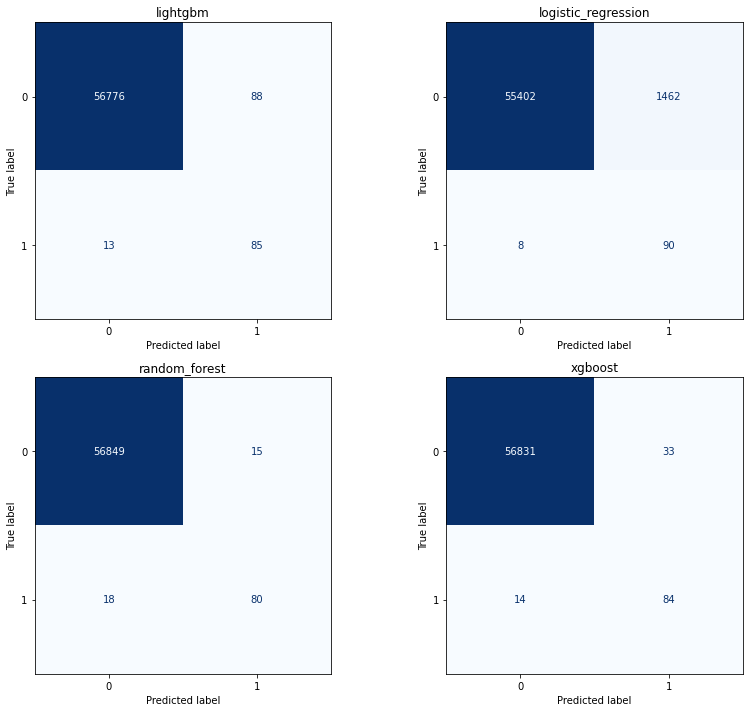
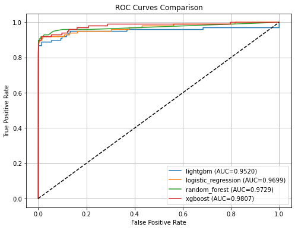
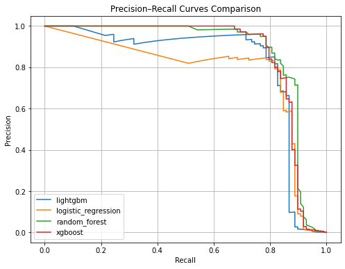

# 📘 Development of Web-based Machine Learning System for Real-time Financial Fraud Detection

This project builds a AI Credit Card Fraud Detection that uses  Machine Learning Algorithm  for inference  and Web Development Framework  for end user interaction.

	

---

## 🧠 Model Overview

- **Models Used:**
  - `LogisticRegression``  
  - `LightGBM` 
  - `RandomForest` 
  - `xgboost` 
  
- **Text Processing:**  `SMOTE Technique
- **Train/Test Split:** 80/20

---

## 🔢 Confusion Matrix
The confusion matrix displays the count of true positives, true negatives, false positives, and false negatives, giving insight into how well the model is classifying each class

	

---

## 📈 ROC Curve
AUC values closer to 1.0 suggest the model can correctly rank positive instances higher than negative ones across a wide range of thresholds, reflecting robust classification performance

	

---
## 🎯 Precision-Recall Curve

The high AUC score indicates that the model achieves a strong trade-off between precision and recall, demonstrating effective discrimination between positive and negative reviews

	

